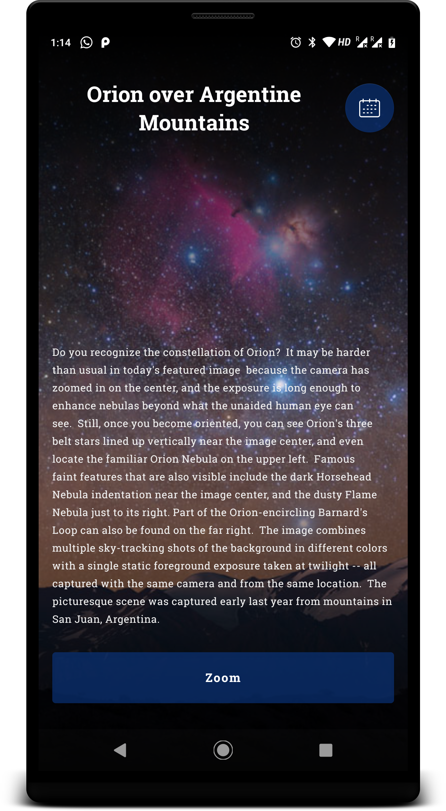
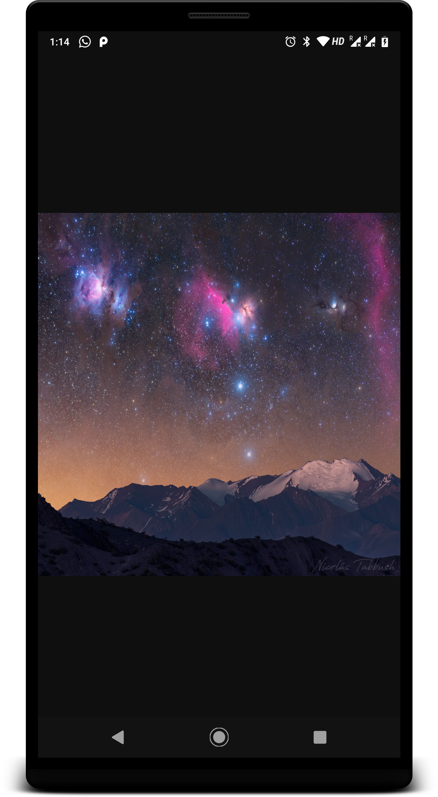
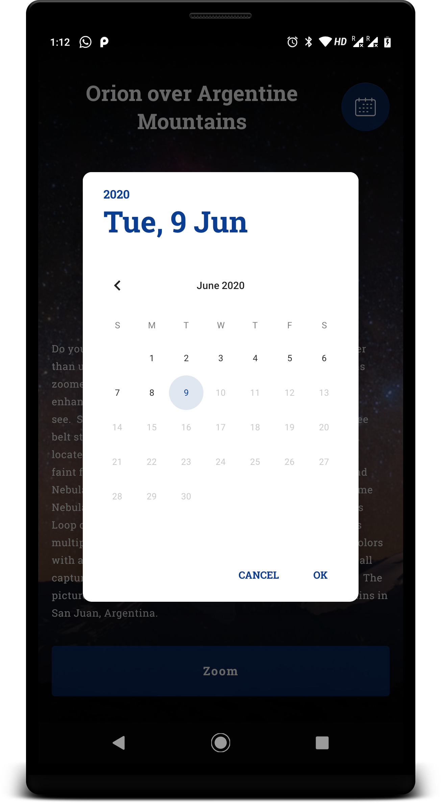

# Nasa APOD App  

### Kotlin  

### About
AndroidX  
Material UI  
Jetpack Navigation Library  
RxJava 2.0  
Dagger 2  
Retrofit & OkHttp3  
Picasso - Image Loading  
ExoPlayer  - Video  
PhotoView - Image Zoom  
Youtube Link Extractor  

### Walk-through  

App Icon is universe logo in midnight blue bg  
Colors used: NASA Colors:  Orioles Orange (#FC3D21) & Midnight Blue (#0B3D91)  

Screen 1  : News Screen
Shows Nasa Astronomy photo of the day  
Calendar button on top right shows Date picker to pick a date  

when in Loading State : Progress bar shown  
when in Network Error State : SnackBar with message is shown with retry action.  
Zoom / Play button shown below description depending upon the Video / Image   
Clicking on Button navigates to Screen 2  

Screen 2 : Photo full Screen / Video Screen   

 
 
  

